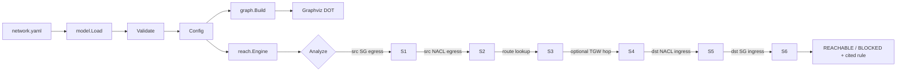

# Architecture

## Data flow

## Packet walk

For a query `(src, dst, port, protocol)` the engine resolves each endpoint to `{ENI?, IP, Subnet?, VPC?}` then walks stages in order. The first stage to deny short-circuits with the specific rule id and text. If all stages pass, the packet is reachable.

1. **Source SG egress** — iterate the source ENI's security groups; a matching `(protocol, port, to-cidr)` allows.
2. **Source NACL egress** — rules sorted ascending by `rule_no`, first match wins (`allow` or `deny`).
3. **Source subnet route lookup** — longest-prefix match against the attached route table. If the target is `tgw-*`, we recurse into the Transit Gateway route table for a second lookup.
4. **Destination NACL ingress** — same evaluation as (2), but on the destination subnet.
5. **Destination SG ingress** — matching `(protocol, port, from-cidr)` on any SG attached to the destination ENI allows.

External destinations (IPs outside any VPC CIDR) skip destination NACL/SG since there is no in-model peer.

## Design decisions

- **`net/netip`, not `net`**. Immutable, comparable, zero-alloc address types. Preferred by upstream Go for anything that isn't a socket.
- **Longest-prefix match on route tables**. Mirrors real VPC routing semantics; a `/32` beats a `/16` beats `0.0.0.0/0`.
- **NACLs first-match by rule number, SGs any-match**. This matches AWS behavior. Getting this wrong is the most common hand-wave in whiteboard analyses.
- **Endpoints resolve as ENI id, then IP, then CIDR containment**. Lets you query with `eni-web`, `10.0.1.10`, or an external `1.1.1.1` without switching modes.
- **Cited rule on every hop**. The `Result.Path` is the audit trail — you can hand the output to a reviewer and they can point at the exact SG or NACL rule that mattered.
- **gonum/graph for topology, not reachability**. Reachability is not a graph BFS in the AWS model — it's a filter cascade. gonum earns its place in the `graph` subcommand where we emit Graphviz DOT.
- **Slog + wrapped errors**. `fmt.Errorf("%w", err)` throughout so `errors.Is/As` works upstream. `slog` structured logs so a CI pipeline can grep them.
- **Cobra for CLI**. Standard AWS-adjacent tooling convention; makes flags, help, and subcommands ergonomic.

## Non-goals

- VPC peering, PrivateLink endpoints, NLB/ALB, IAM policy evaluation.
- IPv6 (types support it but rules and testdata are IPv4).
- Stateful connection tracking beyond the initiating direction.
- Multi-region / multi-account graphs.

## Testing strategy

`internal/reach/engine_test.go` covers:

- Reachable to internet via IGW route.
- Blocked by SG ingress (port not open).
- Blocked by NACL deny rule (lower rule number wins).
- Blocked by missing route.
- Reachable across a Transit Gateway attachment.
- Blocked by SG egress restriction.

CI (`.github/workflows/ci.yml`) runs `go vet`, `go test -race`, builds the binary, and executes it against `testdata/simple.yaml` to catch integration regressions.
